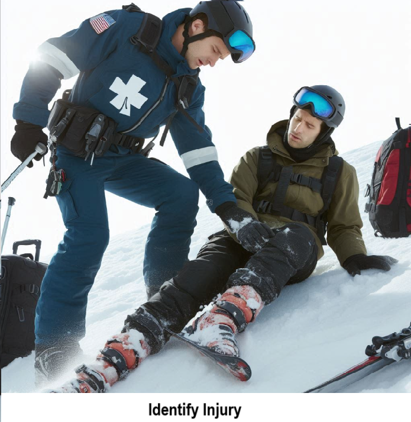

    
# Common Skiing Injuries 

## A list of common skiing injuries a National Ski Patrol person may face.

    

    

## 10 most common injuries

Here are the 10 most common injuries a National Ski Patrol member might face while providing care on the slopes:

1. **Knee Injuries (ACL/MCL Tears)**  
   - Skiers and snowboarders often experience knee injuries due to twisting falls or awkward landings, especially involving the anterior cruciate ligament (ACL) or medial collateral ligament (MCL).

2. **Fractures (Arm, Leg, Wrist)**  
   - High-speed falls or collisions can lead to fractures in various parts of the body, with wrist and leg fractures being particularly common.

3. **Shoulder Dislocations/Separations**  
   - Falling onto an outstretched hand or awkwardly tumbling on the slopes can lead to shoulder injuries, such as dislocations or separations.

4. **Head Injuries (Concussions or Traumatic Brain Injuries)**  
   - Even with helmets, skiers and snowboarders are at risk of head injuries from collisions or falls, leading to concussions or more serious traumatic brain injuries.

5. **Spinal Injuries**  
   - Serious falls or collisions can result in spinal injuries, ranging from mild strains to severe vertebral fractures or spinal cord injuries.

6. **Ankle Injuries (Sprains or Fractures)**  
   - Snowboarders, in particular, are prone to ankle sprains and fractures due to the nature of their sport and how they fall.

7. **Wrist Sprains/Fractures**  
   - Snowboarders often brace their falls with their hands, leading to wrist injuries such as sprains or fractures.

8. **Hypothermia**  
   - Prolonged exposure to cold, especially if skiers or snowboarders are injured or immobile, can lead to hypothermia, a potentially life-threatening condition.

9. **Frostbite**  
   - Extremities like fingers, toes, and ears can be affected by frostbite due to prolonged exposure to cold temperatures without adequate protection.

10. **Skiers’ Thumb (UCL Injury)**  
   - This occurs when the thumb is caught in a ski pole during a fall, leading to damage to the ulnar collateral ligament (UCL) in the thumb.

These injuries require quick and effective care by National Ski Patrol members, emphasizing their role in both emergency response and injury prevention.

## Treatment Summary 

1. **Knee Injuries (ACL/MCL Tears)**  
   - NSP patrollers stabilize the knee with a splint or brace, apply ice to reduce swelling, and arrange for evacuation to medical facilities for further evaluation and possible imaging.

2. **Fractures (Arm, Leg, Wrist)**  
   - Patrollers immobilize the fracture using splints or padding, elevate if possible, and apply ice to reduce swelling before arranging for transport to a medical center.

3. **Shoulder Dislocations/Separations**  
   - The shoulder is stabilized with a sling or immobilizer, and patrollers avoid attempts to relocate the shoulder on-site, instead transporting the patient for further medical treatment.

4. **Head Injuries (Concussions or Traumatic Brain Injuries)**  
   - NSP patrollers assess for signs of concussion or severe head injury, monitor for loss of consciousness or disorientation, and recommend immediate medical evaluation, ensuring the patient does not continue skiing.

5. **Spinal Injuries**  
   - Patrollers immobilize the spine using a backboard and cervical collar to prevent further injury, and they facilitate urgent evacuation via sled or helicopter to a hospital for evaluation.

6. **Ankle Injuries (Sprains or Fractures)**  
   - Ankle injuries are treated by immobilizing the joint with a splint or brace, applying ice, and advising rest, with evacuation to a medical facility for diagnosis.

7. **Wrist Sprains/Fractures**  
   - The wrist is splinted and immobilized, ice is applied, and the patient is referred for further medical evaluation to assess the severity of the injury.

8. **Hypothermia**  
   - Patrollers immediately remove the patient from cold exposure, provide insulation and dry clothing, and offer warm fluids, arranging urgent medical evacuation for severe cases.

9. **Frostbite**  
   - Affected areas are carefully insulated, avoiding direct heat, and patients are evacuated to medical care, where rewarming can be done under controlled conditions to prevent further tissue damage.

10. **Skiers’ Thumb (UCL Injury)**  
   - Patrollers immobilize the thumb with a splint or supportive wrap, apply ice, and suggest medical follow-up for assessment of ligament damage and possible surgical intervention.

    

    
## Getting Started

The goal of this solution is to **Jump Start** your development and have you up and running in 30 minutes. 

To get started with the **Common Skiing Injuries** solution repository, follow these steps:
1. Clone the repository to your local machine.
2. Install the required dependencies listed at the top of the notebook.
3. Explore the example code provided in the repository and experiment.
4. Run the notebook and make it your own - **EASY !**
    
## Solution Features

- Easy to understand and use  
- Easily Configurable 
- Quickly start your project with pre-built templates
- Its Fast and Automated
- Saves You Time 

## ⚙️ Key Features

- ✅ **Self Documenting** Automatically identifies and annotates major steps in a notebook, making the codebase readable and well structured.
- ✅ **Self Testing** Includes built in **unit tests** for each function to validate logic and ensure code reliability.
- ✅ **Easily Configurable** Uses a simple **config.ini** file for centralized settings and easy customization through key value pairs.
- ✅ **Talking Code** explains itself through inline commentary, helping you understand both **what** it does and **why** it does it.
- ✅ **Self Logging** extends Python’s standard **logging** module for **step by step runtime insights**.
- ✅ **Self Debugging** Includes debugging hooks and detailed error tracing to simplify development and troubleshooting.
- ✅ **Low Code or  No Code** Designed to minimize complexity — most full solutions are under 50 lines of code.
- ✅ **Educational** Each template includes educational narrative and background context to support learning, teaching, and collaborative development.

    